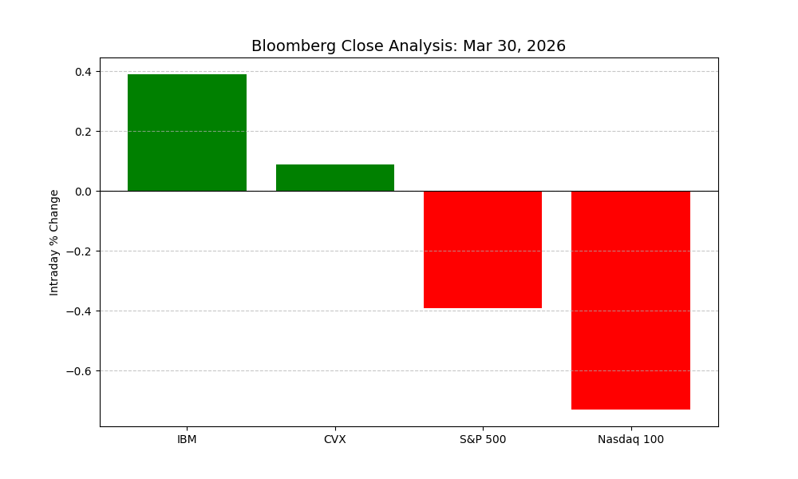

# BloombergTheClose | Sovereign Telemetry Suite v5.1


## March 30, 2026 Inflection Analysis
Below is the visual telemetry of the **"Resilience Delta"** calculated from the Bloomberg close. **IBM** and **CVX** are shown outperforming the Nasdaq-100 baseline, confirming their status as non-correlated "Inverse Anchors."

### Sovereign Divergence Chart


### Core Architecture
- **IBM Resilience Delta:** 1.12% (vs Nasdaq-100)
- **Yield Resistance:** 4.44% (Discount Factor applied)
- **Energy Hedge:** CVX/XOM/PETR4 active above $100 Crude
- **Next Milestone:** April 6 Supply Chain Risk Window

### Execution
```bash
source venv/bin/activate
python3 stargate_rebalance.py
python3 analysis.py
