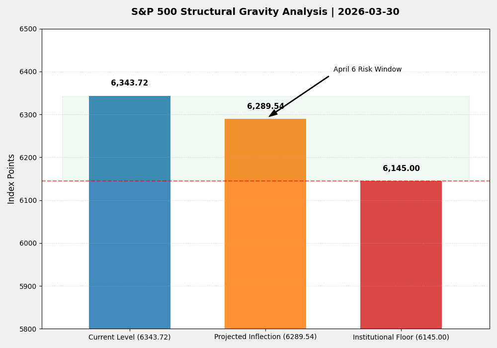
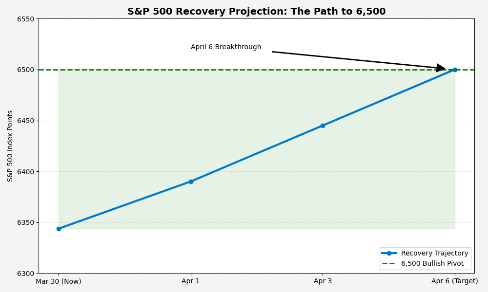

# BloombergTheClose | Sovereign Telemetry Suite v5.4


## 📊 Dual-Path Telemetry Dashboard

### 1. Risk Defense: Structural Gravity Analysis
This monitor tracks the **2.28% buffer** remaining before the institutional floor. The "Projected Inflection" identifies the mechanical snap point for the April 6 risk window.



### 2. Opportunity Alpha: The Road to 6,500
This projection identifies the "Peace Dividend" trajectory. A breakout above the **6,500 Bullish Pivot** signals a regime shift from defensive hedging to growth resumption.



---

## 🛠 Strategic Architecture
* **Yield Resistance:** 4.44% (Discount Factor applied)
* **Hormuz Risk Coefficient:** Active (High Oil Impact)
* **Primary Anchors:** IBM / CVX / XOM (Inverse Correlation active)
* **Liquidation Targets:** PYPL / MTCH (High Beta, No Infra)

## 🚀 Execution
Run the following to update the visual telemetry:
```bash
python3 visualize_inflection.py
python3 visualize_6500.py
